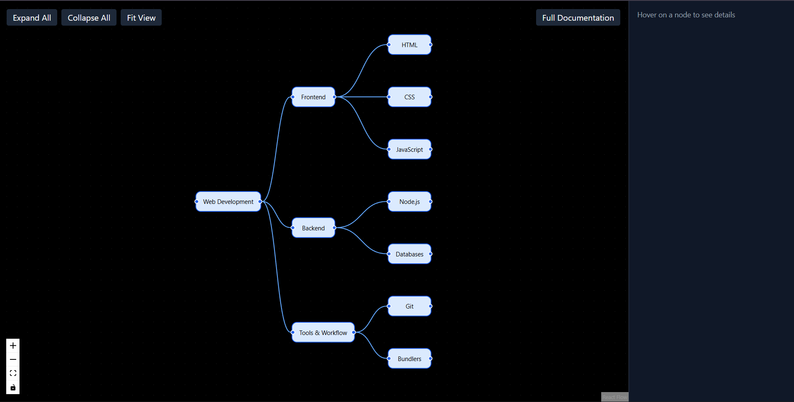

# Interactive Mindmap UI

## Overview

This project is an interactive, data-driven **Mindmap UI**. The goal was to visualize hierarchical data as a mindmap while supporting rich user interactions such as hover previews, expand/collapse behavior, edge highlighting, and contextual data display  all driven entirely from a structured data file.

The focus of this implementation is clarity, usability, and clean separation between data and UI logic.

---

## Objectives Covered 
- Build complex, interactive frontend interfaces
- Work with data-driven visualizations
- Design clear and intuitive user interactions
- Structure frontend code in a scalable and maintainable way

All of these aspects are addressed in this project.

---

## Tech Stack

### Core:-
- **React** – Component-based UI development
- **React Flow** – Graph and node-based visualization
- **Tailwind CSS** – Utility-first styling for fast and consistent UI

### Supporting Libraries:-
- **react-markdown** – Used to render project documentation inside the UI
- **remark-gfm** – GitHub-flavored markdown support

---

## Architecture & Approach

### Data-Driven Rendering:-

The entire mindmap is generated from a structured **JSON data file**.

- No nodes, edges, or hierarchy are hardcoded in the UI
- Updating the JSON automatically updates:
  - Node labels
  - Descriptions
  - Hierarchy
  - Hover summaries
  - Sidebar content

This ensures a clean separation between **data** and **presentation logic**.

---
### Mindmap Generation Flow:-

```text
JSON Data (mindmap.json)
        ↓
generateFlowData()
        ↓
React Flow Nodes & Edges
        ↓
Interactive Mindmap UI
```

A recursive traversal converts hierarchical data into graph nodes while handling layout, spacing, and expand/collapse behavior.

---
## Features

### 1. Mindmap Visualization
- Graph-based layout with nodes and edges
- Clear parent → child relationships
- Adaptive spacing to maintain readability at different depths

---

### 2. Interactive Features

#### Hover Interactions:-
- Hovering over a node shows:
  - A tooltip with a short summary
  - Contextual information in the sidebar
- Related edges visually highlight on hover

#### Click Interactions :-
- Clicking a node expands or collapses its children
- Smooth visual feedback for interaction clarity
- **Fit View** button to reset and center the graph

---

### 3. Data Display

```text
| Location      | Information Displayed                                |
|---------------|------------------------------------------------------|
| Hover Tooltip | Short summary                                        |
| Sidebar Panel | Name, description, examples, keywords (if available) |
```
The UI handles missing fields gracefully without breaking.

---

## Assumptions & Design Decisions

Since some interaction behaviors were not strictly defined in the problem statement, the following assumptions were made to ensure clarity, usability, and predictable behavior:

- **Expand / Collapse Behavior**  
  When a node is collapsed, its children are removed from the rendered graph rather than being visually hidden. This keeps the layout clean, avoids unnecessary clutter, and aligns with common tree and mindmap interaction patterns.

- **Layout Structure**  
  The layout prioritizes clear hierarchical representation and readability over pixel-perfect matching with the reference images. Any visually clear and intuitive hierarchical layout was considered acceptable, as emphasized by the requirement for functional parity rather than exact visual replication.

- **Click vs Hover Interactions**  
  Click interactions are reserved exclusively for structural changes (expand/collapse), while hover interactions are used for previewing contextual information such as summaries and metadata. This separation avoids conflicting behaviors on the same interaction.

- **Inline Editing in UI**  
  Inline editing of nodes directly within the UI was intentionally skipped. Parent nodes already rely on click interactions for expand/collapse, and combining editing with the same interaction introduced UX conflicts and inconsistent states.

- **Data-Driven Editing Model**  
  The application follows a fully data-driven approach. Updating the JSON data file automatically updates the UI, which keeps rendering logic simple and avoids tightly coupling UI state with editable data.

- **Root Node Visibility**  
  The root node remains visible by default to provide a stable entry point into the mindmap and prevent the UI from collapsing into an empty state.

- **Documentation Rendering**  
  Project documentation is rendered directly from the `README.md` file within the UI instead of generating a downloadable PDF. This keeps documentation versioned alongside the codebase and easier to maintain.

These decisions were made intentionally to balance UX clarity, functional correctness, and maintainable frontend architecture.
---

## In-App Documentation:-

- The project documentation is rendered directly from `README.md` using a markdown parser
- Accessible via the **“Full Documentation”** button in the UI
- Keeps documentation versioned with the codebase
- No external downloads or navigation required

---

## Screenshots

### Full Mindmap View


### Hover Interaction & Sidebar


### Expanded State


### Collapsed State


---

## Demo Video

A short screen recording demonstrates:

- Hover interactions
- Expand / collapse behavior
- Edge highlighting
- Sidebar updates
- In-app documentation view

**Video Link:** https://drive.google.com/file/d/1uYHfqwG0t0LUEpTVXUBr3MnKG40uxR9r/view?usp=drive_link

---

## Bonus Features :-

- Edge highlighting on hover
- Smooth visual transitions
- In-app documentation rendering

---

## Known Limitations:-

- Inline UI editing is intentionally skipped (documented design choice)
- No backend or persistence layer (frontend-only scope)
- Inline editing can be added in future by separating edit mode from expand/collapse interactions

---

## Project Structure
```text
mindmap-ui/
├── src/
│ ├── components/
│ │ ├── Mindmap.jsx
│ │ ├── CustomNode.jsx
│ │ ├── Sidebar.jsx
│ │ └── Documentation.jsx
│ ├── data/
│ │ └── mindmap.json
│ └── styles/
├── public/
├── README.md
```
---
## Installation & Running Locally

1. Clone the repository
   ```bash
   git clone https://github.com/your-username/your-repo-name.git
    ```
   ---
2. Navigate to the project directory
    ```bash
    cd mindmap-ui
    ```
    ---
3. Install dependencies
    ```bash
    npm install
    ```
    ---
4. Start the development server
    ```bash
    npm run dev
    ```
    ---
5. Open the app in your browser
    ```bash
    http://localhost:5173  
    ```
    ---